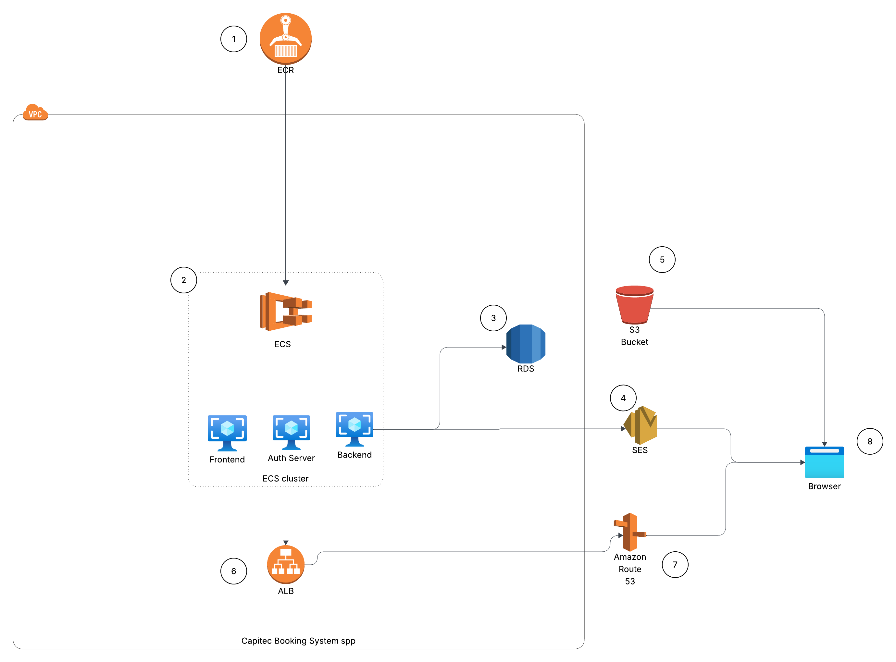

## Introduction

The Capitec Booking system is an application that allows customers to book appointments for bank branch visits across the country.
The application itself is split between 3 different roles (Product-Owner, Bank-Managers/Admins, and Customers).

- Product Owner - Is responsible for adding, and updating existing branches. They are also responsible for promoting specific customer into Admin users who will be able to monitor the bookings within that Capitec branch.
- Administrator - Is responsible for monitoring all the daily appointment books for 1 or more branches.
- Customer - Is responsible for booking appointments with the bank branch.

## Requirements

- **Docker** and **Docker Compose** (for local development)
- **Java 21** (for backend development outside Docker)
- **Node.js 20+** and **npm** (for frontend development outside Docker)
- **PostgreSQL 16** (if running DB outside Docker)


## Quick Start for Local/Dev Development

1. **Clone the repository**
  https://github.com/polokegom/capitec-branch-booking-system

2. **Build and start the full stack using the provided scripts:**

   ### Start application on Windows (Please use PowerShell on Admin mode):
   ```powershell
   # Allows you to execute the below windows scripts to build the image (Please run Powershell in admin mode when running this command)
    Set-ExecutionPolicy -Scope Process -ExecutionPolicy Bypass
    # Build the docker images & start the application
   ./scripts/windows/build-stack.ps1 -Install -Start
    # Quick start if docker images have already been built
   ./scripts/windows/start-local-stack.ps1
   ```

   ### Start application on Linux/macOS (bash - please run on admin mode):
   ```bash
     # Build the docker images & start the application
   ./scripts/linux/build-stack.sh --install --start
     # Quick start if docker images have already been built
   ./scripts/linux/start-local-stack.sh
   ```


   ### These above scripts should do the following:
   - Install frontend dependencies (if needed)
   - Run frontend and backend tests (unless skipped)
   - Build the Angular frontend and Java backend
   - Build Docker images
   - Start all services with Docker Compose (backend, frontend, PostgreSQL, FusionAuth, MailHog)

3. **Access the application:**
   - Frontend: http://localhost:4200
   - Backend API: http://localhost:8080/api/v1
   - Health: http://localhost:8080/q/health
   - Swagger: http://localhost:8080/q/openapi
   - FusionAuth (local auth): http://localhost:9011
   - MailHog (email testing): http://localhost:8025
   - Local owner login: admin@capitec-booking.co.za / password123

4. **Stopping the Application**
To stop all running services on the Capitec Appointment Booking System use the below scripts:

    ### On Windows (PowerShell):
    ```powershell
     # Allows you to execute the below windows scripts to build the image (Please run Powershell in admin mode when running this command)
    Set-ExecutionPolicy -Scope Process -ExecutionPolicy Bypass
    ./scripts/windows/stop-local-stack.ps1
    ```

    ### On Linux/macOS (bash):
    ```bash
    ./scripts/linux/stop-local-stack.sh
    ```

## Overview of cloud architecture

1. ECR is the image registry used to manage versioning of the live application (frontend, backend, fushionauth server)
2. ECS is the orchestration engine used to run all services of the application by pulling the latest changes from ECR
3. RDS for PostgreSQL is a relational database used to manage the systems persistent storage. The reason for using RDS is due to its structured nature for data storage and ACID compliance.
4. SES acts as the SMTP server of the system that is used to send emails to clients.
5. S3 is used to store the systems images which are used when building the systems emails
6. ALB is used to manage incoming traffic that is calling the applications services.
7. Route 53 manages the applications DNS records and domain name routing.
8. User using the application on their browser.